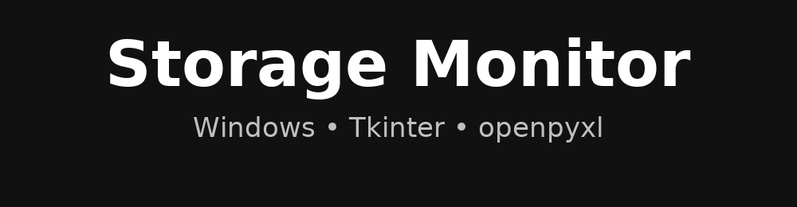
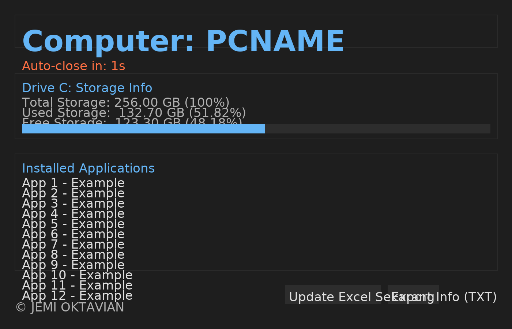
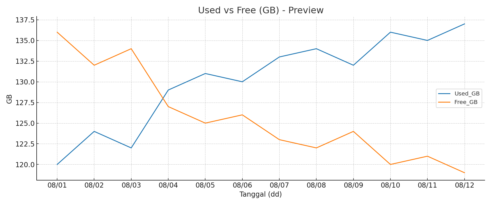

# Storage Monitor (Windows)

## Screenshots & Contoh Output

  

### UI Preview

### Grafik Preview

### Contoh File Excel
- [StorageMonitor_Weekly_Dummy.xlsx](StorageMonitor_Weekly_Dummy.xlsx)
- [StorageMonitor_Weekly_Dummy_1to5_Pie.xlsx](StorageMonitor_Weekly_Dummy_1to5_Pie.xlsx)

> Letakkan berkas di atas ke root repo kamu. Atau, unduh dari lampiran chat ini dan commit ke folder `assets/`/root sesuai path di README.
